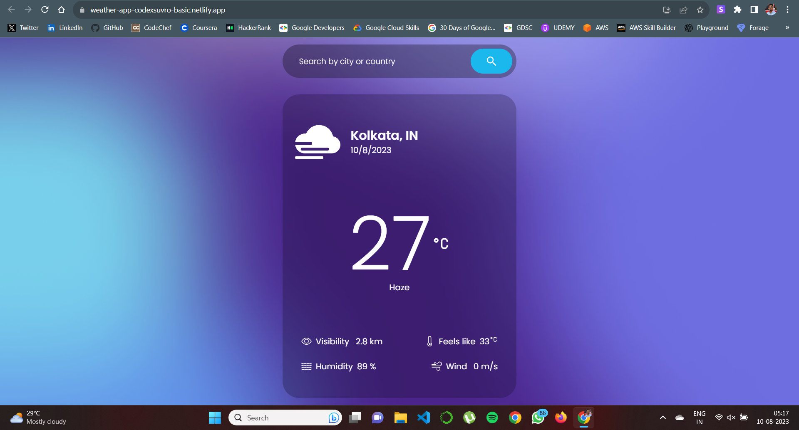

# Weather App using React, Tailwind CSS, PostCSS, and OpenWeather API

This project is a simple and stylish Weather App built using React, Tailwind CSS, PostCSS, and the OpenWeather API. It allows users to quickly check the current weather conditions, temperature, and other relevant weather information for a specific location.

## Features

- **Real-time Weather Data**: The app fetches real-time weather data using the OpenWeather API, providing accurate and up-to-date information.
- **Responsive Design**: The user interface is designed to be responsive, ensuring a seamless experience across various devices and screen sizes.
- **Search Functionality**: Users can search for weather information in different cities around the world and view the results instantly.
- **Weather Details**: In addition to the current temperature, the app also displays other essential weather details such as humidity, wind speed, and atmospheric pressure.
- **User-Friendly Interface**: The intuitive and user-friendly interface makes it easy for users to interact with the app and access the information they need.

## Technologies Used

- **React**: A popular JavaScript library for building user interfaces, enabling the creation of dynamic and interactive components.
- **Tailwind CSS**: A utility-first CSS framework that streamlines the styling process and ensures consistent and responsive designs.
- **PostCSS**: A tool for transforming CSS with JavaScript, allowing for the use of modern CSS features and improved code maintainability.
- **OpenWeather API**: A reliable API that provides current weather data for locations worldwide.

## Getting Started

1. Clone the repository: `git clone https://github.com/your-username/weather-app.git`
2. Navigate to the project directory: `cd weather-app`
3. Install dependencies: `npm install`
4. Create a `.env` file based on the `.env.example` template and add your OpenWeather API key.
5. Start the development server: `npm start`

## Usage

1. Open the app in your web browser.
2. Enter the name of a city in the search bar and press Enter.
3. View the real-time weather information for the specified city.

## Contributing

Contributions are welcome! If you find any bugs or want to improve the app, feel free to open an issue or submit a pull request. Please ensure that your contributions adhere to the project's coding standards and guidelines.

---

**Note:** This project was created for educational purposes and to demonstrate the integration of various technologies. The weather data provided by the app may not always be accurate or up-to-date.
